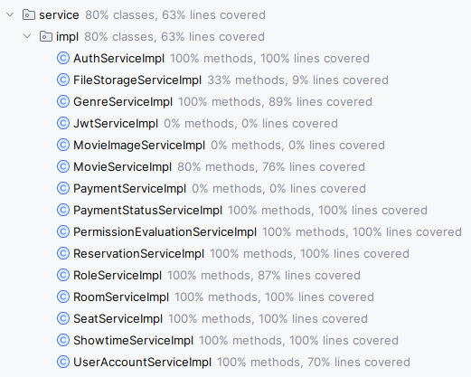
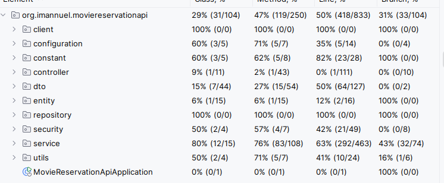

# Movie Reservation API

# Technologies Used
- Java 17
- Java Stream
- Spring boot
- Spring JPA (Native Query)
- PostgreSQL
- Spring Security
- JWT
- Jakarta Validation API
- Lombok
- Swagger
- OpenFeign
- Swagger
- Midtrans

# Database design:
- role: type of role
- payment_status: type of available payment status
- user: store user and role detail
- genre: store movie genre
- file: store file content type, file name, path, and size
- movie: store movie title, description, duration in minute, release date
- movie_image: conjunction table between movie and file
- room: store room
- seat: store individual seat and room
- showtime: store showtime
- reservation: store reservation detail
- seat_reservation: store seat reserved for reservation
- payment: store payment gateway detail

# Key Functionalities
1. User Authentication
    - Signup: User can create an new account
    - Login: User can login to access account
    - Role Management: Users can be promoted to admin
    - JWT: to secure API
2. Genre management
    - Admin can manage genre
    - Users can fetch genre
3. Movie Management
    - Admin can manage movie
    - users can fetch movie
4. Room management
    - Admin can manage room
    - Users can fetch room
5. Seat Management
    - Admin can manage seat
    - Users can fetch seat
6. Showtime Management
    - Admin can manage showtime
    - Users can fetch available showtime, filter showtime
    - Users can fetch available seat on specific showtime
7. Reservation Management
    - Users can create and cancel reservation
    - Users can check all booked reservation

# Endpoints
Complete endpoint documentation available on `/swagger-ui/index.html`

1. Authentication:
- POST `/api/register`: create new account
- PUT `/api/login`: login to account

2. Genre Management:
- GET `/api/genres`: fetch all genres
    - the response is paginated
- GET `/api/genres/{id}`: fetch genre by id
- POST `/api/genres`: create genre
- PUT `/api/genres/{id}`: update genre
- DELETE `/api/genres/{id}`: delete genre

3. Access Image File:
- GET `/api/files/images/{id}`: fetch image by id

4. Movie Management:
- GET `/api/movies`: fetch all movies
    - can filtered by movie title
    - the response is paginated
- GET `/api/movies/{id}`: fetch movie by id
- POST `/api/movies`: create movie
- PUT `/api/movies/{id}`: update movie
- DELETE `/api/movies/{id}`: delete movie

5. Room management:
- GET `/api/rooms`: fetch all rooms
    - the response is paginated
    - include seats
- GET `/api/rooms/{id}`: fetch room by id
    - include seats
- POST `/api/rooms`: create room
- PUT `/api/rooms/{id}`: update room
- DELETE `/api/rooms/{id}`: delete room

6. Seat management:
- GET `/api/seats`: fetch all seats
    - the response is paginated
- GET `/api/seats/room/{id}`: fetch room seats
- POST `/api/seats`: create seat
- PUT `/api/seats/{id}`: update seat
- DELETE `/api/seats/{id}`: delete seat

7. Showtime management:
- GET `/api/showtimes/all`: fetch all showtimes (include past)
    - the response is paginated
- GET `/api/showtimes`: fetch all available showtimes (start from today)
    - can filtered by date
    - can filtered by movie title
    - the response is paginated
- GET `/api/showtimes/{id}`: fetch showtimes by id
- GET `/api/showtimes/{id}/seats`: fetch seats available on showtimes
- POST `/api/showtimes`: create showtime
- PUT `/api/showtimes/{id}`: update showtime

8. Reservation management:
- POST `/api/reservations`: create reservation
    - return payment url
- POST `/api/reservations`: fetch all user reservation
- POST `/api/reservations/{id}`: fetch reservation by id
- DELETE `/api/reservations/{id}`: cancel reservation
    - User can cancel the showtime no later than 1 day before

# Requirement
- Java 17

# Getting Started
run project with maven:
1. Clone repository
   `git clone https://github.com/GtFoBAE05/movie-reservation-api`
2. Open project directory
3. Build project
   `mvn clean install`
4. Run application
   `mvn spring-boot:run`

run project with docker compose:
1. Clone repository
   `git clone https://github.com/GtFoBAE05/movie-reservation-api`
2. Open project directory
3. Run application
   `docker-compose up --build`

# Testing:
current testing coverage for service layer: 80% classes and 63% lines covered

current overal coverage:

**NOTE**:
For development and testing purpose: 
- initial admin account is
    - username: admin
    - password: secretpassword
- also included payment gateway API key for development and testing purposes